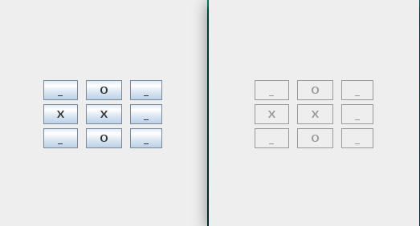

# Tic Tac Toe - Distributed

  

# Introduction

This repository contains a distributed tic-tac-toe game. It was built in the Java language and using the TCP protocol.

# How to run?
open your ide, first run the JogoDaVelha file, then PlayerX and finally PlayerO